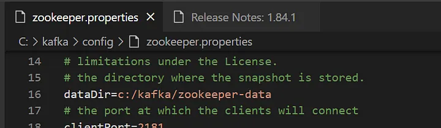

# How to install Apache-kafka on Windows 10

[Frome Here!](https://sahilali.medium.com/installing-apache-kafka-on-windows-10-and-running-your-first-kafka-process-ade2b755aa40)

## Prerequisites
Before we dive into the installation process, make sure you have the following prerequisites in place:

* Java: Apache Kafka is written in Java, so you need to have Java Development Kit (JDK) installed on your Windows machine. You can download and install the latest version of the JDK from the Oracle website or adopt OpenJDK.
* ZooKeeper: Apache Kafka relies on Apache ZooKeeper for distributed coordination. While ZooKeeper is not mandatory for running a single Kafka broker (for development purposes), it’s recommended to have ZooKeeper installed. You can download it from the Apache ZooKeeper website.

## Installing and Setting Up Apache Kafka on Windows
Now that you have the prerequisites ready, follow these steps to install and set up Apache Kafka on Windows:

### Step 1: Download Apache Kafka

Visit the official [Apache Kafka website](https://kafka.apache.org/downloads) and download the latest version of Apache Kafka for Windows. Choose the binary version in .zip format.


### Step 2: Extract the Kafka Archive
Once the download is complete, extract the contents of the .zip archive to a directory of your choice. For example, you can extract it to C:\kafka.


### Step 3.1: Configure Environment Variables
To make Kafka commands accessible from the command line, you need to set up a few environment variables. Follow these steps:

1. Right-click on “This PC” or “My Computer” and select “Properties.”
2. Click on “Advanced system settings” on the left.
3. In the “System Properties” window, click the “Environment Variables” button.
4. Under “System Variables,” find the “Path” variable and click “Edit.”
5. Click “New” and add the path to the Kafka bin directory, e.g., C:\kafka\bin\windows.

### Step 3.2: Edit Config files


Target changes in Server.properties and zookeeper.properties

change this at as you wish location

change datadir at specified location

### Step 4: Start ZooKeeper (Optional)

As mentioned earlier, you can run Kafka without ZooKeeper for development purposes, but it’s a good practice to start ZooKeeper. To do so, open a command prompt and navigate to your ZooKeeper installation directory. Then, run the following command:

```command
zookeeper-server-start .\config\zookeeper.properties
```


### Step 5: Start a Kafka Broker
To start a Kafka broker, open a command prompt and navigate to your Kafka installation directory. Use the following command:

```command
kafka-server-start .\config\server.properties
```


This command will start a Kafka broker using the default configuration. You can also create a custom configuration file if needed and specify it in the command.

### Step 6: Create a Kafka Topic
Now that your Kafka broker is running, you can create a topic using the following command:

```command
kafka-topics --bootstrap-server localhost:9092 --topic first_topic --create --partitions 3 --replication-factor 1
```


This command creates a topic named “first_topic” with one partition and one replication factor. You can adjust these values as needed.

### Step 7: Produce and Consume Messages
You can now produce and consume messages to and from your Kafka topic. To produce a message, use the following command:

```command
kafka-console-producer --bootstrap-server localhost:9092 --topic first_topic
```


To consume messages, use this command in a separate command prompt window:

```command
kafka-console-consumer --bootstrap-server localhost:9092 --topic first_topic
```


Now, you can start sending and receiving messages through your Kafka topic.